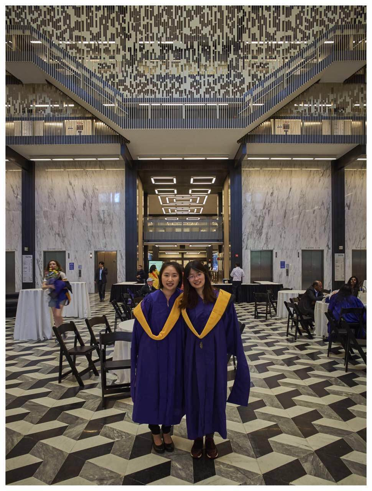

@title[Intro]

@snap[west span-50]
### Hello, everyone! 
### I am Jiali Zhou.
@snapend

@snap[east span-50]

@snapend

---
@title[Broad overview of C1]

@snap[north-west]
#### At @color[grey](**Capital One**)
@snapend

@snap[west span-45]
@ul[spaced]
- Card Organization
- Fraud Team
- Application Fraud
@ulend
@snapend

@snap[east span-55]
@img[shadow](assets/img/credit-card-application.png)
@snapend

---
@title[App Fraud]

@snap[north-west]
#### For @color[grey](**Application Fraud**)
@snapend

@snap[west span-40 text-07]
@ul[spaced]
- Third Party Fraud: Recall, both incidence rate and fraud losses prevented
- First Party Fraud: Precision, fraud losses prevented
@ulend
@snapend

@snap[east span-60]
@img[shadow](assets/img/app-fraud.png)
@snapend

---
@title[3pf]

@snap[north-west]
#### For @color[grey](**3rd Party Fraud Model**)
@snapend

@snap[west span-40 text-07]
@ul[spaced]
- Situation: New platform with an initial defense
- Objective: Add incremental fraud defense
- Evaluation Criteria: Incremental Recall at Incremental Case Rate x%
@ulend
@snapend

@snap[east span-60]
@img[shadow](assets/img/another_defense.png)
@snapend

---
@title[3pf]

@snap[north-west]
#### For @color[grey](**3rd Party Fraud Model**)
@snapend

@snap[west span-30 text-07]
@ul[spaced]
- Data: Network Attributes related with applicant, Bureau Data
- Model: GBM
- Strategy: Weighted Sampling
@ulend
@snapend

@snap[east span-70]
@img[shadow](assets/img/graph.png)
@snapend

---
@title[3pf]

@snap[north-west]
#### For @color[grey](**3rd Party Fraud Model**)
@snapend

@snap[west span-40 text-07]
@ul[spaced]
- UTC(Unable to Confirm) Evaluation
- Fundational test

@ulend
@snapend

@snap[east span-60]
@img[shadow](assets/img/verify_id.png)
@snapend

---
## Q & A ?
